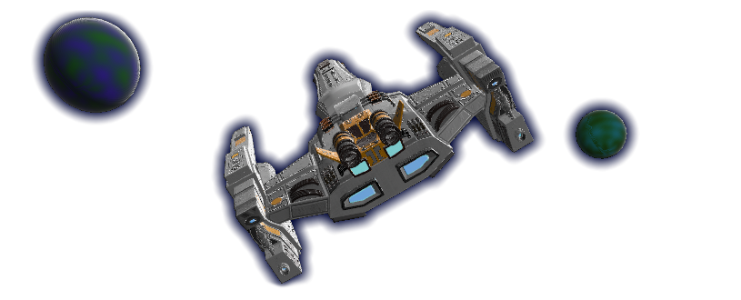
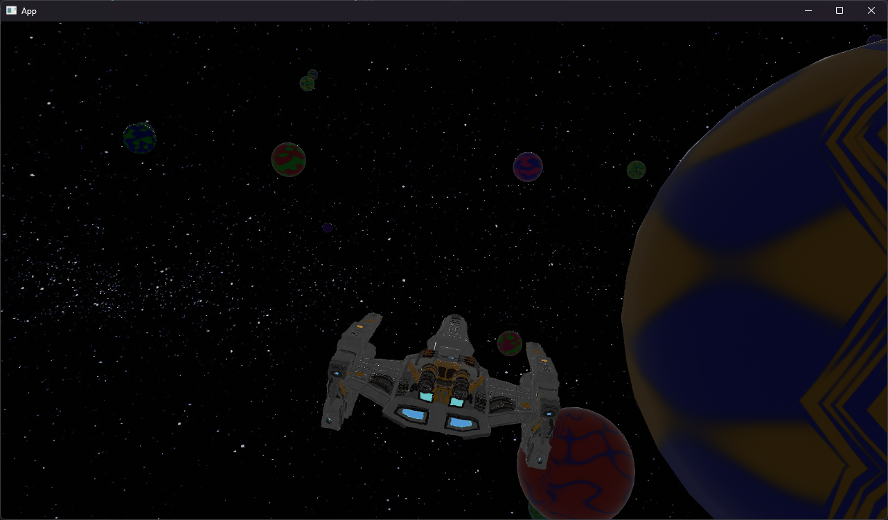

	
	<h1>🚀 3D Space Simulation Game</h1>

A small 3D space simulation game built with [Bevy 0.16](https://bevy.org), featuring:

- A player-controlled spaceship with **Newtonian inertia-based physics**.
- A **third-person chase camera** that follows your ship dynamically.
- A central **sun** with emissive lighting that illuminates the environment.
- Randomly placed **emissive planet spheres** in different colors.
- A **starfield** made from distant emissive points to enhance immersion.
- Full **WASD + mouse** control for 6-DOF space navigation.

### 🕹️ Controls

| Key / Input | Action                               |
| ----------- | ------------------------------------ |
| `W`         | Forward thrust                       |
| `S`         | Reverse thrust / brake               |
| `A`         | Roll left                            |
| `D`         | Roll right                           |
| Mouse       | Pitch (up/down) and Yaw (left/right) |

### 🛸 3D Models

**Note:** You need to manually download and place these 3D models into your `assets` directory:

- **Space Fighter**:
  [Download from CGTrader](https://www.cgtrader.com/items/4796579/download-page)
  Rename the file to `space_fighter.glb` and place it under `assets/`.

- **Space Rocket** *(optional alternative)*:
  [Download from CGTrader](https://www.cgtrader.com/items/3494266/download-page)
  Rename accordingly if you want to use it as `space_rocket.glb`.
You also need to update the `main.rs` file to use this model instead of the default fighter.

 
 

